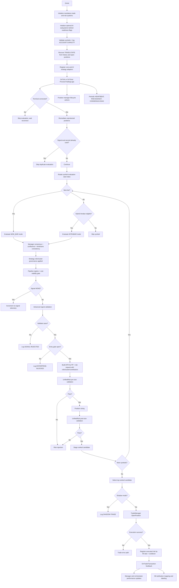

# Runtime Decision Graph

## Document Metadata
- Last Updated: 2026-03-31
- Scope: Runtime signal-to-execution flow
- Source: `MultiStrategyAutonomousEA.mq5`

## Purpose
Defines the authoritative runtime decision path and ownership boundaries between signal generation, validation, risk veto, execution, and post-trade feedback.

## Ownership Map
- Orchestration: `MultiStrategyAutonomousEA.mq5`
- Consensus: `CEnterpriseStrategyManager`
- Filtering: `CUnifiedSignalPipeline`
- AI adaptation/weights: `CAIStrategyOrchestrator`
- Risk veto: `CUnifiedRiskManager`
- Execution: `CTradeManager`
- Position lifecycle: `CAdvancedPositionManager`
- Indicator cache lifecycle: `CIndicatorManager`

## End-to-End Flow

- Manager consensus resolves mixed-timeframe conflicts via `TimeframeConsistency` before final vote selection.
- OnInit is two-tiered: mandatory trade/risk/runtime bootstrap remains fatal, while auxiliary AI brain/orchestrator/adaptation modules degrade behind readiness flags and do not abort the EA.

## Intrabar Policy
- New-bar and intrabar paths are explicit evaluation modes.
- Intrabar eligibility respects symbol scope and cadence interval.
- Intrabar scans are now budgeted per cycle and ranked by symbol yield instead of simple full-set round-robin.
- Symbols back off after repeated `raw_none` / `zero_voter` intrabar outcomes and recover on the next new bar.
- Intrabar/new-bar consensus behavior is manager-controlled.
- Cooldown, total-position, unprotected-position, and per-symbol capacity checks are entry gates, not scan gates; the EA keeps evaluating symbols while blocked from sending.
- Vote admission into timeframe consistency and quorum uses the pipeline's effective confidence floor for that evaluation, not just the static base pipeline minimum.
- Quorum uses normalized weighted conviction pooling (intrabar eligibility defines the active live-voter pool for intrabar scans):
  - adjusted live weight = `base strategy weight x role multiplier x healthScore reliability multiplier`
  - ready live weight = `adjusted live weight x pipeline readinessScore`
  - conviction score = confidence shaped by pipeline `contextScore`, `readinessScore`, and `costScore`
  - per-direction score = `sum(ready live weight x conviction score)` for agreeing live voters
  - directional quality = `direction score / direction weight`
  - support ratio = `direction weight / total ready live weight`
  - direction passes full quorum if directional quality clears the **adaptive** quorum threshold, support clears the scan-mode floor, agreeing voters clear the effective minimum, and ready-live participation stays above `InpConsensusMinReadyWeightRatio`
  - **Adaptive quorum thresholds** (Batch 41): consensus now adjusts required directional quality and support floors based on actual active voter count to prevent denominator dilution:
    - **1 active voter**: directional quality ≥ 0.40, support ≥ 0.15 (was impossible 0.55 / 0.35)
    - **2 active voters**: directional quality ≥ 0.48, support ≥ 0.30 (was 0.55 / 0.35)
    - **3+ active voters**: directional quality ≥ 0.55, support ≥ 0.35 (standard `InpQuorumThreshold` / floor inputs)
    - Eliminates zero-score vetoes for legitimate single/dual-voter consensus by adjusting thresholds to the actual voter pool
  - **Dynamic weight decay** (Batch 41): strategies that filter ≥ 3 consecutive cycles have their live weight decayed by `m_strategyActivityDecayRate` per additional cycle, reducing the denominator as dormant strategies fall out of contribution; weight recovers when the strategy produces a vote again
- If both directions qualify inside the configured deadband, consensus is vetoed instead of forcing a weak winner.
- Intrabar can instead admit a tagged `SPARSE_INTRABAR` decision when exactly one direction survives with one voter and readiness/context/cost/support/coverage thresholds all remain strong.
- Pipeline and validator profiles (confidence + confluence + quality) are configured separately from AI thresholds so non-AI strategies are not gated by AI policy.

## Strategy Governance Policy
- Manager-level strategy metadata controls live-vote authority:
  - role: `PRIMARY_ALPHA`, `CONTEXT_FEATURE`, `SHADOW_RESEARCH`
  - cluster: `TREND_CLUSTER`, `MEAN_REVERSION_CLUSTER`, `STRUCTURE_CLUSTER`, `NONE`
- Default policy:
  - all enabled retained strategies are registered as `PRIMARY_ALPHA` and vote live
  - per-strategy inputs gate registration (disabled strategies are not registered into the pool)
- Intrabar policy is explicit per strategy:
  - `LIVE`: full quorum participant during intrabar scans
  - `PROBE`: evaluated intrabar but only eligible for sparse admission
  - `OFF`: skipped before pipeline work
- Governance is continuous, not only binary:
  - closed-trade outcomes update rolling `healthScore`
  - reliability multipliers scale live vote impact without bypassing role/cluster controls
- Intrabar participation remains explicit: Momentum and Unified ICT are the default intrabar voters, while Fibonacci and Support/Resistance can be opted in for smoke tests via dedicated inputs.

## AI Runtime Path
- `CNextGenStrategyBrain` now runs in a single local transformer mode; there is no runtime Python/cloud branch.
- AI adapters avoid same-bar recomputation:
  - neural votes come from `GetNeuralSignalCached(...)`
  - transformer and ensemble adapters cache per-bar inference outcomes and reuse them until the bar changes
- Feature-build or inference failures are cached as `NONE` for the remainder of the bar, preventing repeated failed forward passes on unchanged data.
- Ensemble confidence is now derived from class probabilities returned by `GetPredictions(...)`, keeping the adapter path aligned with the transformer's classifier output semantics.

## Regime/Cost Pre-Gate
- `CRegimeEngine` runs before validator and can veto entries on:
  - spread-shock cooldown
  - spread/ATR ratio breach
  - late-entry z-score outlier
- `UnifiedSignalPipeline` caches structural context per symbol/timeframe/bar and carries forward evidence scores:
  - `readinessScore`
  - `contextScore`
  - `costScore`
  - effective confidence floor
  - soft-threshold pass flag
- On transient warmup / handle-init / buffer-copy faults, `CRegimeEngine` can reuse a recent valid same-symbol/timeframe snapshot instead of forcing immediate neutral degradation.
- Repeated regime data faults trigger bounded handle reset and retry eligibility instead of indefinite stale-handle behavior.
- Pipeline threshold adaptation now also consumes the regime snapshot, so confidence uplift/relaxation is aligned with the same market-state authority that drives the cost gate.
- Near-threshold signals may survive the pipeline when readiness/context evidence is strong; the gate remains bounded rather than becoming a blanket relaxation.
- Gate telemetry:
  - `[REGIME-STATE]`
  - `[COST-GATE]`
  - `[ENTRY-VETO]`
  - `[PIPELINE-THRESHOLD]`

## Risk Hardening
- Daily budget gate uses effective daily risk:
  - max(executed entry risk, mark-to-market equity loss from daily baseline, current open portfolio stop risk).
- Any open position without stop-loss protection is treated as a hard veto state.
- Runtime performs deterministic unprotected-position remediation (restore SL, then force-close EA-owned positions after bounded failed attempts).
- Risk validation remains two-phase (`pre-size`, `post-size`) through unified authority.
- Operator telemetry now splits daily budget components: `entry`, `mtm`, `open_exposure`, `effective`.
- Risk gate now enforces cluster governance:
  - same-symbol opposing-cluster mutex
  - max concurrent positions per cluster
  - max projected cluster risk cap

## Execution Hardening
- Fill policy is configurable via EA input (`IOC` default).
- Market sends are synchronous by default.
- Transient retcodes use bounded retry with immediate refresh/reprice instead of sleep-based blocking.
- `LOCKED`/`FROZEN` retcodes use single bounded retry to avoid prolonged retry loops.
- Market orders rebuild execution price and protective stops at submit time.
- Protective stop modifications are throttled but allow emergency bypass for missing/tightening protection.
- Symbol scan order rotates each cycle to reduce first-symbol concentration when only one trade is allowed per cycle.
- The runtime no longer executes the first valid symbol blindly; it stages `[SCAN-CANDIDATE]` entries and promotes the best `[SCAN-DECISION]` at the end of the cycle.
- `TradeManager` emits `[EXECUTION-RECEIPT]` with requested/fill size, retcode, request id, and retries; partial fills emit `[FILL-DIFF]`.
- `UnifiedRiskManager` registers executed risk using fill ratio so daily risk usage matches actual exposure.

## Diagnostics
- Startup affordability emitted as `[ACCOUNT-CAPACITY]`.
- Startup cooldown recovery emitted as `[TRADE-STATE]`.
- Weighted quorum evaluation emitted as `[CONSENSUS-QUORUM]`.
- Post-quorum nullification emitted as `[CONSENSUS-VETO]` when timeframe consistency or intrabar single-voter safety clears a candidate.
- Sparse-admission success emitted as `[CONSENSUS-SPARSE]`; near-miss sparse/full-quorum failures emitted as `[CONSENSUS-NEARMISS]`.
- Scheduler budget and per-symbol backoff are emitted as `[SCAN-BUDGET]` and `[INTRABAR-BACKOFF]`.
- Ranked approved candidates emitted as `[SCAN-CANDIDATE]`.
- Final cycle winner emitted as `[SCAN-DECISION]`.
- Consensus reason counters emitted as `[CONSENSUS-DIAG]`:
  - `raw_none`
  - `filtered_out`
  - `quorum_failed`
  - `intrabar_not_eligible`
- Startup execution posture emitted as `[EXECUTION-MODE]`.
- Confirmed deal lifecycle emitted as `[TRADE-CONFIRMED]`.
- Entry-suppressed approved signals emitted as `[ENTERPRISE-BLOCKED]`.
- Consensus dominant-cause attribution emitted as `[CONSENSUS-ROOT]`.
- Strategy-level none-reason attribution emitted as `[CONSENSUS-STRATEGY]`.
- Heartbeat aggregate consensus snapshots emitted as `[CONSENSUS-SNAPSHOT]`.
- **Detailed veto diagnostics** (Batch 41): consensus veto messages now explain the exact failure reason with concrete values:
  - `no_voters`: "No strategies produced votes in this evaluation cycle"
  - `insufficient_quality`: "quality=0.15 (need 0.40) | votes=1 | support=0.25" (shows actual vs required, voter count, support ratio)
  - `insufficient_support`: "support=0.25 (need 0.30) | votes=2 | quality=0.48" (shows actual vs required, voter count, quality)
  - `insufficient_readiness_weight`: "readyWeight=2.15 < minRequired=3.25" (shows ready vs minimum required weight)
  - `direction_quorum_not_met`: "buy=0.48|0.25 vs sell=0.52|0.30" (shows buy/sell quality and support for comparison)
  - Eliminates guesswork by always printing the numeric mismatch and failing condition
- Heartbeat aggregate strategy reject buckets emitted as `[STRATEGY-REJECTS]`.
- Confidence-threshold source emitted as `[PIPELINE-THRESHOLD]` with tags:
  - `REGIME_RANGE`
  - `REGIME_TREND_RELAX`
  - `REGIME_BREAKOUT_RELAX`
  - `REGIME_CHAOS`
  - `REGIME_ENGINE_WARMUP`
- Runtime conversion tracking emitted as `[HEARTBEAT-FUNNEL]` and `[CONVERSION-RATES]`.
- Prolonged no-signal dominance alert emitted as `[NO-SIGNAL-ALERT]`.
- Regime transient-fault reuse and repeated-fault reset are emitted under `[REGIME-STATE]`.
- Trend indicator mature-series readiness faults and bounded set reinitialization are emitted under `[TrendEngine][READINESS-FAULT]`.
- Strategy-governance telemetry emitted as `[CONSENSUS-ROLE]`, `[CONSENSUS-CLUSTER]`, and heartbeat `[ROLE-CLUSTER]`.
- Cluster risk telemetry emitted as `[RISK-CLUSTER]` and `[RISK-MUTEX-BLOCK]`.
- Risk budget decomposition: `[RISK-BUDGET]`
- Unprotected remediation lifecycle: `[RISK-UNPROTECTED]`
- External position capacity blocks: `[CAPACITY-EXTERNAL]`
- Execution receipt telemetry: `[EXECUTION-RECEIPT]`, `[FILL-DIFF]`
- Per-scan no-trade attribution: `[SCAN-NO-TRADE]`
- Risk-budget sizing caps: `[RISK-CAP]`
- Execution preflight and ambiguous broker responses: `[EXECUTION-BLOCKED]`, `[EXECUTION-UNCONFIRMED]`

## 2026-03-25 Decision-Path Refinement
- Same-bar structural cache reuse now preserves original engine readiness rather than forcing later scans to assume all engines are ready.
- Structural context reads are fail-soft:
  - ready engine => consume current/reused getters
  - not-ready engine => consume neutral defaults and lower readiness score
- Candidate construction now happens under a capped risk budget from `CUnifiedRiskManager`, so sizing aligns with remaining daily/portfolio headroom before post-size veto.
- Live execution success now requires a confirmed fill retcode or bounded history confirmation; a raw broker `Buy/Sell(...) == true` no longer qualifies on its own.

## 2026-03-31 AXIOM Runtime Refactor
- Optional AI bootstrap now degrades cleanly:
  - NextGen brain failure disables dashboard AI status only
  - orchestrator failure disables adaptation/weight sync only
  - AI engine failure disables adaptive engine processing only
- AI hot paths are now allocation-stable and bar-cached:
  - NextGen market data uses a ring buffer
  - uncertainty and NN training histories use ring buffers
  - transformer/ensemble/NN votes run once per bar instead of once per tick
- Clean detector ATR paths now reuse cached handles during repeated detection passes rather than creating indicator handles inside hot loops.

## 2026-04-01 Default Runtime Efficiency Path
- Baseline interpretation step:
  - `default.log` proved that saved MT5 runtime state can diverge from source defaults
  - operators should confirm `[EXECUTION-MODE]` and `[CADENCE-CONFIG]` before treating a run as a default baseline
- Trend-readiness path:
  - indicator handles available
  - ATR buffer read succeeds => normal trend/regime evidence
  - ATR buffer read fails but bounded fallback succeeds => degraded-but-valid evidence with readiness-state logging
  - fallback fails => reuse/neutral path with explicit degradation, not silent false-ready voting
- Scan-loop path:
  - detect new-bar work
  - compute intrabar selections
  - emit `[SCAN-BUDGET]` with `active_work`
  - if `active_work=false`, skip the symbol loop and attribute the idle cycle
  - otherwise continue through consensus -> validator -> risk -> execution
- Governance path:
  - `Support/Resistance` intrabar toggle now preserves probe semantics in manager governance logs and runtime behavior

## 12. 2026-03-30 Unified ICT Integration
- `StrategyUnifiedICT` pipeline replaces the prior counting gate with `ScoreConfluences(...)` (max 130 weighted points).
- Confidence limits are dynamically set by `ComputeEntryConfidence(...)` using MS Break type (CHoCH vs BOS) and `CAMDDetector` Distribution sweeps.
- Final entry `SICTEntrySetup` carries partial close sizes (`lot1Pct`, `lot2Pct`, `lot3Pct`) ready for the executor.
- Stop losses are automatically pushed to `breakevenPrice` when TP1 hits an opposing structural CE (Consequent Encroachment) defined by `CalculateTakeProfits(...)`.
- `CICTPositionSizer` injects localized risk-per-trade guard checks tied to dynamic equity-balance drawdowns.

## 13. 2026-03-30 Support/Resistance & Trendline Overhaul
- **Look-Ahead Blocking**: `CTrendEntryTypes`, `CSRBounceStrategy`, and `CSRBreakoutStrategy` evaluate historical and live signals explicitly against `bar[1]` (confirmed-bar completion) to prevent pseudo-signals drawn from open repainting wicks.
- **Dynamic Array Sorting**: Visual indicators emitted by `DrawLevels()` and `DrawTrendlines()` are governed by an internal strength-sorted bubble algorithm, isolating system rendering strictly to the most statistically resonant boundaries.
- **Explicit ATR Targeting**: Takes priority over fixed pips across `CADXPositionSizing` and strategy mappers. Position lot sizing explicitly resolves absolute market Tick Distance formulas against equity risk rather than arbitrary percentages.

## AI Runtime Evidence
- `[AI-VOTE][Transformer]`
- `[AI-VOTE][Ensemble]`
- NN health/labeling logs where enabled

## Invariants
- No direct ad-hoc order sends in decision path.
- Unified risk gate must approve before execution.
- Shadow mode executes full decision stack but does not send orders.
- Runtime requires hedging account semantics and rejects unsupported margin modes during startup.
- `CIndicatorManager::DestroyInstance()` must run on deinit.
- Removed strategy families are not represented in runtime registration paths.
- Unified ICT runtime labeling is normalized (no legacy `Unified ICT/SMC` path labels).

## Fast Debug Read Order
1. `[ACCOUNT-CAPACITY]` / `[TRADE-STATE]`
2. `[HEARTBEAT]`
3. `[HEARTBEAT-FUNNEL]` / `[CONVERSION-RATES]`
4. `[CONSENSUS-QUORUM]` / `[CONSENSUS-VETO]` / `[CONSENSUS-DIAG]` / `[CONSENSUS-ROOT]` / `[CONSENSUS-STRATEGY]`
5. `[CONSENSUS-SNAPSHOT]` / `[STRATEGY-REJECTS]`
6. `[PIPELINE-THRESHOLD]` / `[REGIME-STATE]` / `[TrendEngine][READINESS-FAULT]`
7. `[SIGNAL-REJECTED]`
8. `[RISK-BUDGET]`
9. `[RISK-UNPROTECTED]` / `[CAPACITY-EXTERNAL]`
10. `[AI-VOTE]`
11. `[NO-SIGNAL-ALERT]`
12. `[SHADOW-TRADE]` or `[TRADE-SUCCESS]/[TRADE-ERROR]`

## 2026-04-01 Strategy Registry + AI Runtime Flow
- Startup now includes a registry-resolution stage before manager bootstrap:
  - build curated indicator roster
  - overlay AI availability
  - resolve `InpEAMode` to an effective mode
  - emit `[STRATEGY-REGISTRY]`
- Manager bootstrap now registers strategies from the registry roster instead of separate indicator vs AI branches.
- Candidate path now includes a mode-admission checkpoint between consensus and risk:
  - invalid mode/family combinations are rejected before risk sizing
  - `AI_ASSISTED` can add `[AI-MODE-BONUS]` to aligned indicator-primary candidates
- Hybrid cadence now has a bounded keepalive branch when primary intrabar scheduling yields zero selected symbols:
  - `[SCAN-BUDGET] ... intrabar_keepalive=true`
- Trend readiness path now distinguishes:
  - handle invalid
  - insufficient chart history
  - partial indicator readiness
  - MA manual fallback
  - ATR manual fallback
  - snapshot reuse
