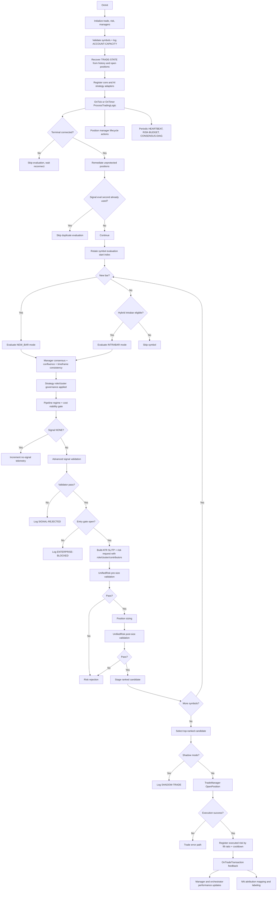

# Runtime Decision Graph

## Document Metadata
- Last Updated: 2026-03-25
- Scope: Runtime signal-to-execution flow
- Source: `MultiStrategyAutonomousEA.mq5`

## Purpose
Defines the authoritative runtime decision path and ownership boundaries between signal generation, validation, risk veto, execution, and post-trade feedback.

## Ownership Map
- Orchestration: `MultiStrategyAutonomousEA.mq5`
- Consensus: `CEnterpriseStrategyManager`
- Filtering: `CUnifiedSignalPipeline`
- AI adaptation/weights: `CAIStrategyOrchestrator`
- Risk veto: `CUnifiedRiskManager`
- Execution: `CTradeManager`
- Position lifecycle: `CAdvancedPositionManager`
- Indicator cache lifecycle: `CIndicatorManager`

## End-to-End Flow

- Manager consensus resolves mixed-timeframe conflicts via `TimeframeConsistency` before final vote selection.

## Intrabar Policy
- New-bar and intrabar paths are explicit evaluation modes.
- Intrabar eligibility respects symbol scope and cadence interval.
- Intrabar/new-bar consensus behavior is manager-controlled.
- Cooldown, total-position, unprotected-position, and per-symbol capacity checks are entry gates, not scan gates; the EA keeps evaluating symbols while blocked from sending.
- Vote admission into timeframe consistency and quorum uses the pipeline's effective confidence floor for that evaluation, not just the static base pipeline minimum.
- Quorum uses normalized weighted conviction pooling (intrabar eligibility defines the active live-voter pool for intrabar scans):
  - adjusted live weight = `base strategy weight x role multiplier x healthScore reliability multiplier`
  - ready live weight = `adjusted live weight x pipeline readinessScore`
  - conviction score = confidence shaped by pipeline `contextScore`, `readinessScore`, and `costScore`
  - per-direction score = `sum(ready live weight x conviction score)` for agreeing live voters
  - normalized score = `direction score / total ready live weight`
  - direction passes quorum if `normalized_score >= InpQuorumThreshold`, agreeing voters `>= InpMinLiveVoters`, and ready-live participation stays above `InpConsensusMinReadyWeightRatio`
- If both directions qualify inside the configured deadband, consensus is vetoed instead of forcing a weak winner.
- Single-voter intrabar output still requires configured minimum confidence.
- Pipeline and validator profiles (confidence + confluence + quality) are configured separately from AI thresholds so non-AI strategies are not gated by AI policy.

## Strategy Governance Policy
- Manager-level strategy metadata controls live-vote authority:
  - role: `PRIMARY_ALPHA`, `CONTEXT_FEATURE`, `SHADOW_RESEARCH`
  - cluster: `TREND_CLUSTER`, `MEAN_REVERSION_CLUSTER`, `STRUCTURE_CLUSTER`, `NONE`
- Default policy:
  - all enabled retained strategies are registered as `PRIMARY_ALPHA` and vote live
  - per-strategy inputs gate registration (disabled strategies are not registered into the pool)
- Governance is continuous, not only binary:
  - closed-trade outcomes update rolling `healthScore`
  - reliability multipliers scale live vote impact without bypassing role/cluster controls
- Intrabar participation remains explicit: Momentum and Unified ICT are the default intrabar voters, while Fibonacci and Support/Resistance can be opted in for smoke tests via dedicated inputs.

## Regime/Cost Pre-Gate
- `CRegimeEngine` runs before validator and can veto entries on:
  - spread-shock cooldown
  - spread/ATR ratio breach
  - late-entry z-score outlier
- `UnifiedSignalPipeline` caches structural context per symbol/timeframe/bar and carries forward evidence scores:
  - `readinessScore`
  - `contextScore`
  - `costScore`
  - effective confidence floor
  - soft-threshold pass flag
- On transient warmup / handle-init / buffer-copy faults, `CRegimeEngine` can reuse a recent valid same-symbol/timeframe snapshot instead of forcing immediate neutral degradation.
- Repeated regime data faults trigger bounded handle reset and retry eligibility instead of indefinite stale-handle behavior.
- Pipeline threshold adaptation now also consumes the regime snapshot, so confidence uplift/relaxation is aligned with the same market-state authority that drives the cost gate.
- Near-threshold signals may survive the pipeline when readiness/context evidence is strong; the gate remains bounded rather than becoming a blanket relaxation.
- Gate telemetry:
  - `[REGIME-STATE]`
  - `[COST-GATE]`
  - `[ENTRY-VETO]`
  - `[PIPELINE-THRESHOLD]`

## Risk Hardening
- Daily budget gate uses effective daily risk:
  - max(executed entry risk, mark-to-market equity loss from daily baseline, current open portfolio stop risk).
- Any open position without stop-loss protection is treated as a hard veto state.
- Runtime performs deterministic unprotected-position remediation (restore SL, then force-close EA-owned positions after bounded failed attempts).
- Risk validation remains two-phase (`pre-size`, `post-size`) through unified authority.
- Operator telemetry now splits daily budget components: `entry`, `mtm`, `open_exposure`, `effective`.
- Risk gate now enforces cluster governance:
  - same-symbol opposing-cluster mutex
  - max concurrent positions per cluster
  - max projected cluster risk cap

## Execution Hardening
- Fill policy is configurable via EA input (`IOC` default).
- Market sends are synchronous by default.
- Transient retcodes use bounded retry with immediate refresh/reprice instead of sleep-based blocking.
- `LOCKED`/`FROZEN` retcodes use single bounded retry to avoid prolonged retry loops.
- Market orders rebuild execution price and protective stops at submit time.
- Protective stop modifications are throttled but allow emergency bypass for missing/tightening protection.
- Symbol scan order rotates each cycle to reduce first-symbol concentration when only one trade is allowed per cycle.
- The runtime no longer executes the first valid symbol blindly; it stages `[SCAN-CANDIDATE]` entries and promotes the best `[SCAN-DECISION]` at the end of the cycle.
- `TradeManager` emits `[EXECUTION-RECEIPT]` with requested/fill size, retcode, request id, and retries; partial fills emit `[FILL-DIFF]`.
- `UnifiedRiskManager` registers executed risk using fill ratio so daily risk usage matches actual exposure.

## Diagnostics
- Startup affordability emitted as `[ACCOUNT-CAPACITY]`.
- Startup cooldown recovery emitted as `[TRADE-STATE]`.
- Weighted quorum evaluation emitted as `[CONSENSUS-QUORUM]`.
- Post-quorum nullification emitted as `[CONSENSUS-VETO]` when timeframe consistency or intrabar single-voter safety clears a candidate.
- Ranked approved candidates emitted as `[SCAN-CANDIDATE]`.
- Final cycle winner emitted as `[SCAN-DECISION]`.
- Consensus reason counters emitted as `[CONSENSUS-DIAG]`:
  - `raw_none`
  - `filtered_out`
  - `quorum_failed`
  - `intrabar_not_eligible`
- Startup execution posture emitted as `[EXECUTION-MODE]`.
- Confirmed deal lifecycle emitted as `[TRADE-CONFIRMED]`.
- Entry-suppressed approved signals emitted as `[ENTERPRISE-BLOCKED]`.
- Consensus dominant-cause attribution emitted as `[CONSENSUS-ROOT]`.
- Strategy-level none-reason attribution emitted as `[CONSENSUS-STRATEGY]`.
- Heartbeat aggregate consensus snapshots emitted as `[CONSENSUS-SNAPSHOT]`.
- Heartbeat aggregate strategy reject buckets emitted as `[STRATEGY-REJECTS]`.
- Confidence-threshold source emitted as `[PIPELINE-THRESHOLD]` with tags:
  - `REGIME_RANGE`
  - `REGIME_TREND_RELAX`
  - `REGIME_BREAKOUT_RELAX`
  - `REGIME_CHAOS`
  - `REGIME_ENGINE_WARMUP`
- Runtime conversion tracking emitted as `[HEARTBEAT-FUNNEL]` and `[CONVERSION-RATES]`.
- Prolonged no-signal dominance alert emitted as `[NO-SIGNAL-ALERT]`.
- Regime transient-fault reuse and repeated-fault reset are emitted under `[REGIME-STATE]`.
- Trend indicator mature-series readiness faults and bounded set reinitialization are emitted under `[TrendEngine][READINESS-FAULT]`.
- Strategy-governance telemetry emitted as `[CONSENSUS-ROLE]`, `[CONSENSUS-CLUSTER]`, and heartbeat `[ROLE-CLUSTER]`.
- Cluster risk telemetry emitted as `[RISK-CLUSTER]` and `[RISK-MUTEX-BLOCK]`.
- Risk budget decomposition: `[RISK-BUDGET]`
- Unprotected remediation lifecycle: `[RISK-UNPROTECTED]`
- External position capacity blocks: `[CAPACITY-EXTERNAL]`
- Execution receipt telemetry: `[EXECUTION-RECEIPT]`, `[FILL-DIFF]`

## AI Runtime Evidence
- `[AI-VOTE][Transformer]`
- `[AI-VOTE][Ensemble]`
- NN health/labeling logs where enabled

## Invariants
- No direct ad-hoc order sends in decision path.
- Unified risk gate must approve before execution.
- Shadow mode executes full decision stack but does not send orders.
- Runtime requires hedging account semantics and rejects unsupported margin modes during startup.
- `CIndicatorManager::DestroyInstance()` must run on deinit.
- Removed strategy families are not represented in runtime registration paths.
- Unified ICT runtime labeling is normalized (no legacy `Unified ICT/SMC` path labels).

## Fast Debug Read Order
1. `[ACCOUNT-CAPACITY]` / `[TRADE-STATE]`
2. `[HEARTBEAT]`
3. `[HEARTBEAT-FUNNEL]` / `[CONVERSION-RATES]`
4. `[CONSENSUS-QUORUM]` / `[CONSENSUS-VETO]` / `[CONSENSUS-DIAG]` / `[CONSENSUS-ROOT]` / `[CONSENSUS-STRATEGY]`
5. `[CONSENSUS-SNAPSHOT]` / `[STRATEGY-REJECTS]`
6. `[PIPELINE-THRESHOLD]` / `[REGIME-STATE]` / `[TrendEngine][READINESS-FAULT]`
7. `[SIGNAL-REJECTED]`
8. `[RISK-BUDGET]`
9. `[RISK-UNPROTECTED]` / `[CAPACITY-EXTERNAL]`
10. `[AI-VOTE]`
11. `[NO-SIGNAL-ALERT]`
12. `[SHADOW-TRADE]` or `[TRADE-SUCCESS]/[TRADE-ERROR]`
