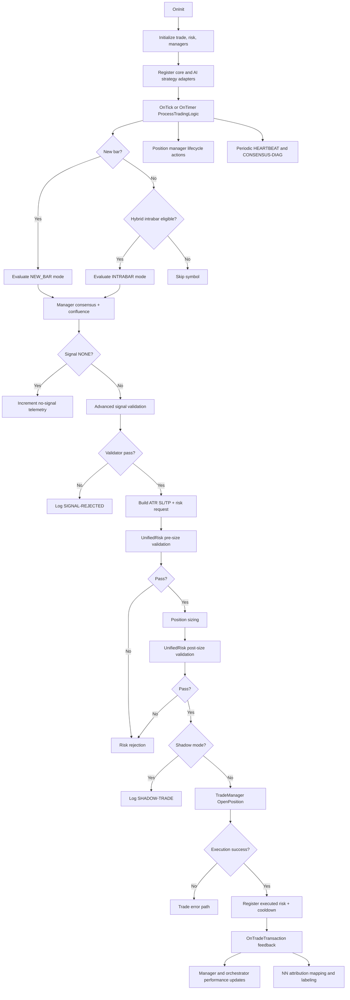

# Runtime Decision Graph

## Document Metadata
- Last Updated: 2026-02-22
- Scope: Runtime signal-to-execution flow
- Source: `MultiStrategyAutonomousEA.mq5`

## Purpose
Defines the authoritative runtime decision path and ownership boundaries between signal generation, validation, risk veto, execution, and post-trade feedback.

## Ownership Map
- Orchestration: `MultiStrategyAutonomousEA.mq5`
- Consensus: `CEnterpriseStrategyManager`
- Filtering: `CUnifiedSignalPipeline`
- AI adaptation/weights: `CAIStrategyOrchestrator`
- Risk veto: `CUnifiedRiskManager`
- Execution: `CTradeManager`
- Position lifecycle: `CAdvancedPositionManager`
- Indicator cache lifecycle: `CIndicatorManager`

## End-to-End Flow

## Intrabar Policy
- New-bar and intrabar paths are explicit evaluation modes.
- Intrabar eligibility respects symbol scope and cadence interval.
- Intrabar/new-bar consensus behavior is manager-controlled.

## Diagnostics
- Consensus reason counters emitted as `[CONSENSUS-DIAG]`:
  - `raw_none`
  - `filtered_out`
  - `quorum_failed`
  - `intrabar_not_eligible`

## AI Runtime Evidence
- `[AI-VOTE][Transformer]`
- `[AI-VOTE][Ensemble]`
- NN health/labeling logs where enabled

## Invariants
- No direct ad-hoc order sends in decision path.
- Unified risk gate must approve before execution.
- Shadow mode executes full decision stack but does not send orders.
- `CIndicatorManager::DestroyInstance()` must run on deinit.

## Fast Debug Read Order
1. `[HEARTBEAT]`
2. `[CONSENSUS-DIAG]`
3. `[SIGNAL-REJECTED]`
4. `[AI-VOTE]`
5. `[SHADOW-TRADE]` or `[TRADE-SUCCESS]/[TRADE-ERROR]`
