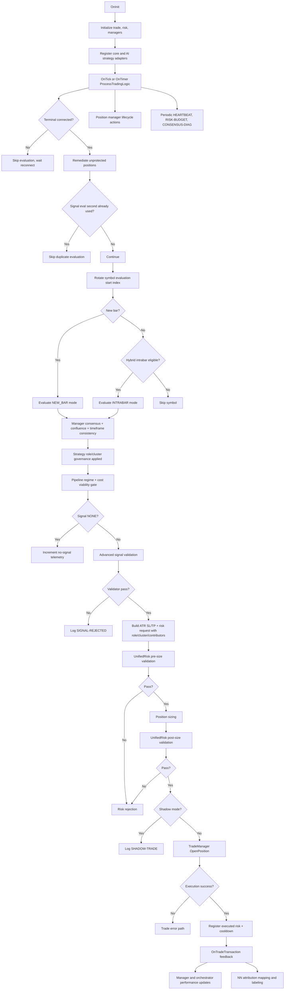

# Runtime Decision Graph

## Document Metadata
- Last Updated: 2026-03-16
- Scope: Runtime signal-to-execution flow
- Source: `MultiStrategyAutonomousEA.mq5`

## Purpose
Defines the authoritative runtime decision path and ownership boundaries between signal generation, validation, risk veto, execution, and post-trade feedback.

## Ownership Map
- Orchestration: `MultiStrategyAutonomousEA.mq5`
- Consensus: `CEnterpriseStrategyManager`
- Filtering: `CUnifiedSignalPipeline`
- AI adaptation/weights: `CAIStrategyOrchestrator`
- Risk veto: `CUnifiedRiskManager`
- Execution: `CTradeManager`
- Position lifecycle: `CAdvancedPositionManager`
- Indicator cache lifecycle: `CIndicatorManager`

## End-to-End Flow

- Manager consensus resolves mixed-timeframe conflicts via `TimeframeConsistency` before final vote selection.

## Intrabar Policy
- New-bar and intrabar paths are explicit evaluation modes.
- Intrabar eligibility respects symbol scope and cadence interval.
- Intrabar/new-bar consensus behavior is manager-controlled.
- Intrabar quorum can operate in contributor-aware dynamic mode:
  - actual live contributors this cycle `<=1` => effective quorum `1`
  - else effective quorum `min(intrabar_min_quorum, actual_live_contributors_this_cycle)`
- Single-voter intrabar output still requires configured minimum confidence.
- Pipeline and validator confidence floors are configured separately from AI thresholds so non-AI strategies are not gated by AI policy.

## Strategy Governance Policy
- Manager-level strategy metadata controls live-vote authority:
  - role: `PRIMARY_ALPHA`, `CONTEXT_FEATURE`, `SHADOW_RESEARCH`
  - cluster: `TREND_CLUSTER`, `MEAN_REVERSION_CLUSTER`, `STRUCTURE_CLUSTER`, `NONE`
- Soft-quarantine default:
  - live voters: `Momentum`, `Trend`, `Unified ICT`
  - feature/shadow contributors (diagnostics only by default): `Candlestick`, `Fibonacci`, `Elliott Wave`, `Support/Resistance`
- Non-live contributors are still evaluated for attribution but are explicitly excluded from final live quorum voting.

## Regime/Cost Pre-Gate
- `CRegimeEngine` runs before validator and can veto entries on:
  - spread-shock cooldown
  - spread/ATR ratio breach
  - late-entry z-score outlier
- Pipeline threshold adaptation now also consumes the regime snapshot, so confidence uplift/relaxation is aligned with the same market-state authority that drives the cost gate.
- Gate telemetry:
  - `[REGIME-STATE]`
  - `[COST-GATE]`
  - `[ENTRY-VETO]`
  - `[PIPELINE-THRESHOLD]`

## Risk Hardening
- Daily budget gate uses effective daily risk:
  - max(executed entry risk, mark-to-market equity loss from daily baseline, current open portfolio stop risk).
- Any open position without stop-loss protection is treated as a hard veto state.
- Runtime performs deterministic unprotected-position remediation (restore SL, then force-close EA-owned positions after bounded failed attempts).
- Risk validation remains two-phase (`pre-size`, `post-size`) through unified authority.
- Operator telemetry now splits daily budget components: `entry`, `mtm`, `open_exposure`, `effective`.
- Risk gate now enforces cluster governance:
  - same-symbol opposing-cluster mutex
  - max concurrent positions per cluster
  - max projected cluster risk cap

## Execution Hardening
- Fill policy is configurable via EA input (`IOC` default).
- Market sends are synchronous by default.
- Transient retcodes use bounded retry with immediate refresh/reprice instead of sleep-based blocking.
- `LOCKED`/`FROZEN` retcodes use single bounded retry to avoid prolonged retry loops.
- Market orders rebuild execution price and protective stops at submit time.
- Protective stop modifications are throttled but allow emergency bypass for missing/tightening protection.
- Symbol scan order rotates each cycle to reduce first-symbol concentration when only one trade is allowed per cycle.

## Diagnostics
- Consensus reason counters emitted as `[CONSENSUS-DIAG]`:
  - `raw_none`
  - `filtered_out`
  - `quorum_failed`
  - `intrabar_not_eligible`
- Startup execution posture emitted as `[EXECUTION-MODE]`.
- Confirmed deal lifecycle emitted as `[TRADE-CONFIRMED]`.
- Consensus dominant-cause attribution emitted as `[CONSENSUS-ROOT]`.
- Strategy-level none-reason attribution emitted as `[CONSENSUS-STRATEGY]`.
- Heartbeat aggregate consensus snapshots emitted as `[CONSENSUS-SNAPSHOT]`.
- Heartbeat aggregate strategy reject buckets emitted as `[STRATEGY-REJECTS]`.
- Confidence-threshold source emitted as `[PIPELINE-THRESHOLD]` with tags:
  - `REGIME_RANGE`
  - `REGIME_TREND_RELAX`
  - `REGIME_BREAKOUT_RELAX`
  - `REGIME_CHAOS`
  - `REGIME_ENGINE_WARMUP`
- Runtime conversion tracking emitted as `[HEARTBEAT-FUNNEL]` and `[CONVERSION-RATES]`.
- Prolonged no-signal dominance alert emitted as `[NO-SIGNAL-ALERT]`.
- Strategy-governance telemetry emitted as `[CONSENSUS-ROLE]`, `[CONSENSUS-CLUSTER]`, and heartbeat `[ROLE-CLUSTER]`.
- Cluster risk telemetry emitted as `[RISK-CLUSTER]` and `[RISK-MUTEX-BLOCK]`.
- Risk budget decomposition: `[RISK-BUDGET]`
- Unprotected remediation lifecycle: `[RISK-UNPROTECTED]`
- External position capacity blocks: `[CAPACITY-EXTERNAL]`

## AI Runtime Evidence
- `[AI-VOTE][Transformer]`
- `[AI-VOTE][Ensemble]`
- NN health/labeling logs where enabled

## Invariants
- No direct ad-hoc order sends in decision path.
- Unified risk gate must approve before execution.
- Shadow mode executes full decision stack but does not send orders.
- Runtime requires hedging account semantics and rejects unsupported margin modes during startup.
- `CIndicatorManager::DestroyInstance()` must run on deinit.
- Removed strategy families are not represented in runtime registration paths.
- Unified ICT runtime labeling is normalized (no legacy `Unified ICT/SMC` path labels).

## Fast Debug Read Order
1. `[HEARTBEAT]`
2. `[HEARTBEAT-FUNNEL]` / `[CONVERSION-RATES]`
3. `[CONSENSUS-DIAG]` / `[CONSENSUS-ROOT]` / `[CONSENSUS-STRATEGY]`
4. `[CONSENSUS-SNAPSHOT]` / `[STRATEGY-REJECTS]`
5. `[PIPELINE-THRESHOLD]`
6. `[SIGNAL-REJECTED]`
7. `[RISK-BUDGET]`
8. `[RISK-UNPROTECTED]` / `[CAPACITY-EXTERNAL]`
9. `[AI-VOTE]`
10. `[NO-SIGNAL-ALERT]`
11. `[SHADOW-TRADE]` or `[TRADE-SUCCESS]/[TRADE-ERROR]`
